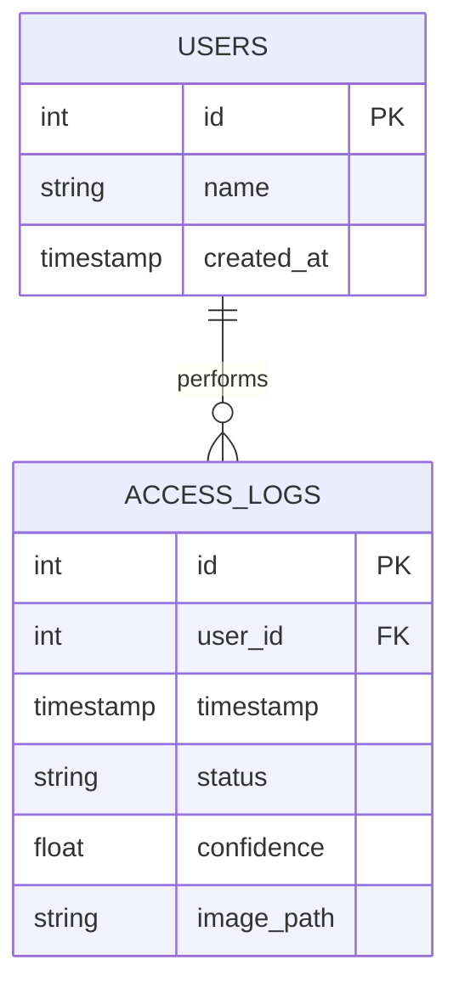
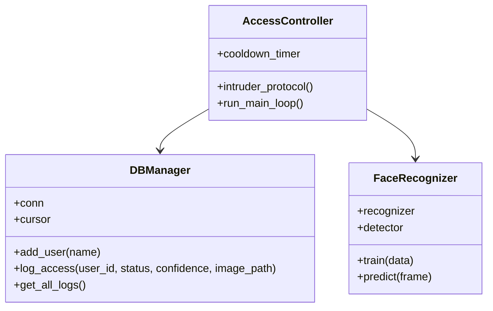

# Informe de Proyecto: Smart-Gate
**Instituto Profesional de Líderes (IPL)**  
**Licenciatura en Inteligencia Artificial**

## 1. Título del Proyecto
"Smart-Gate: Control de Acceso Biométrico con IA y Persistencia de Datos"

## 2. Contextualización del Problema
El sistema Smart-Gate surge de la necesidad de modernizar los controles de acceso institucionales. Los métodos tradicionales (llaves, tarjetas o códigos) son vulnerables al extravío o préstamo. El reconocimiento facial ofrece una capa de seguridad biométrica intransferible. La integración con una base de datos SQL permite una auditoría precisa y en tiempo real de quién entra y quién intenta acceder sin autorización.

## 3. Justificación
- **Optimización:** Automatiza el proceso de registro sin intervención humana constante.
- **Seguridad:** El protocolo de intrusos captura evidencia visual de intentos fallidos.
- **Aprendizaje:** El proyecto demuestra la transición de programación procedimental a Objetos y el manejo de persistencia de datos complejos (imágenes y registros SQL).

## 4. Objetivo General
Desarrollar el sistema Smart-Gate, integrando algoritmos de reconocimiento facial (LBPH) y gestión de datos relacionales para permitir un control de acceso automatizado y seguro.

## 5. Preguntas Orientadoras
- **¿Cómo optimizar el control?** Usando un umbral de confianza (threshold) ajustado para minimizar falsos positivos.
- **¿Seguridad de datos?** Implementando persistencia SQL que separa la identidad del usuario de sus registros de acceso.
- **¿Desafíos?** La variabilidad de iluminación y el tiempo de respuesta en el procesamiento de imágenes en tiempo real.

## 6. Marco Referencial
- **Haar Cascades:** Método de detección de objetos propuesto por Viola y Jones para identificar rostros en imágenes.
- **LBPH (Local Binary Patterns Histograms):** Algoritmo de reconocimiento facial que destaca por su robustez ante cambios de iluminación.
- **Persistencia SQL:** Uso de SQLite para el almacenamiento estructurado de transacciones de acceso.
- **Seguridad Biométrica:** Implementación de protocolos de captura automática ante detecciones no autorizadas.

## 7. Metodología (Etapas)
1. **Investigación:** Selección de OpenCV como librería principal.
2. **Diseño:** Modelado de la base de datos `smart_gate.db`.
3. **Desarrollo:** Implementación de módulos `capture`, `train` y `recognize`.
4. **Validación:** Pruebas de campo con diferentes sujetos y condiciones de luz.

## 8. Propuesta Aplicativa (Diseño Técnico)

### Modelo Entidad-Relación (DER)

### Diagrama de Clases (UML)

## 9. Reflexión Final
El desarrollo de Smart-Gate permitió consolidar conocimientos en Visión Artificial y Bases de Datos. El mayor reto fue el ajuste del umbral de confianza para evitar que sombras o ángulos extremos dispararan el protocolo de intrusos erróneamente. La transición a un modelo orientado a objetos facilitó la escalabilidad del sistema.

## 10. Referencias Bibliográficas (APA 7)
- OpenCV. (2024). *Face Recognition with OpenCV*. https://docs.opencv.org/
- Viola, P., & Jones, M. (2001). *Rapid Object Detection using a Boosted Cascade of Simple Features*. IEEE.
- Ahonen, T., Hadid, A., & Pietikainen, M. (2006). *Face Description with Local Binary Patterns*. IEEE Transactions on Pattern Analysis and Machine Intelligence.
- SQLite. (2024). *SQLite Documentation*. https://www.sqlite.org/docs.html
